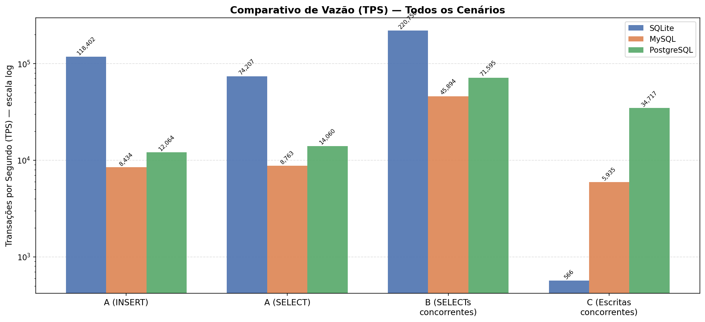
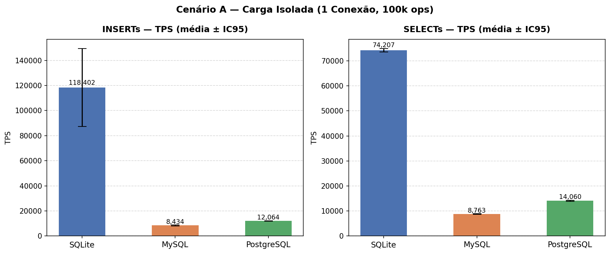
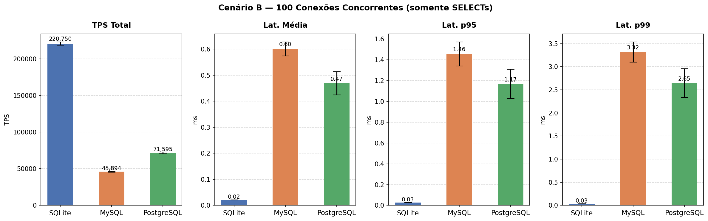
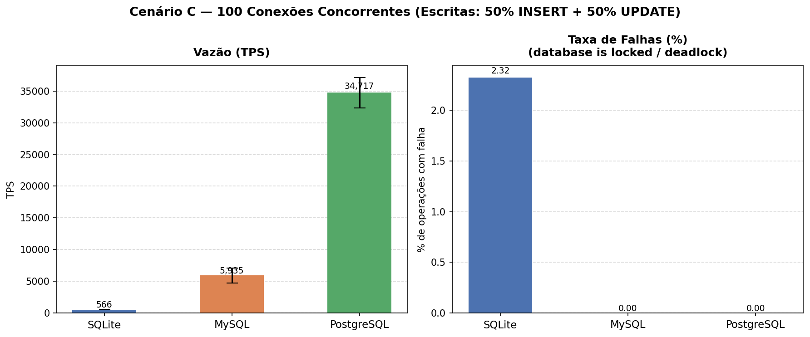
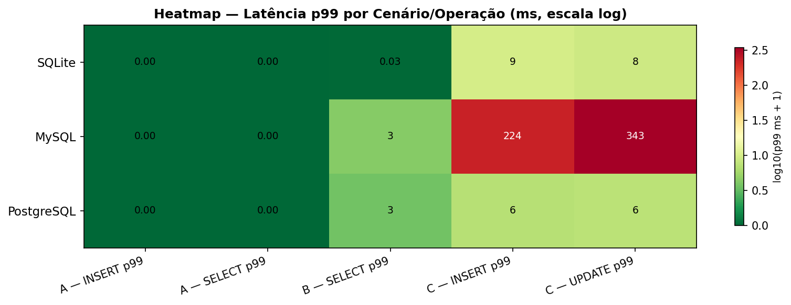

<!-- _class: capa -->

# Benchmark de SGBDs Relacionais
## Processos vs. Threads vs. Acesso Direto

Banco de Dados II

---

# O que estamos comparando?

A **arquitetura interna** de um banco de dados afeta seu desempenho?

> Três bancos, mesmos dados, mesmas operações — paradigmas completamente diferentes.

 

|  | SQLite | MySQL (InnoDB) | PostgreSQL |
|---|---|---|---|
| **Paradigma** | Embarcado | Threads | Processos |
| **Servidor separado?** | ❌ Não | ✅ Sim | ✅ Sim |
| **Rede TCP/IP?** | ❌ Não | ✅ Sim | ✅ Sim |
| **Escritas simultâneas** | Lock exclusivo | MVCC + undo log | MVCC + WAL group commit |

---

# SQLite — Acesso Direto (Embarcado)

### Como funciona
- **Sem servidor** — o banco é uma biblioteca, não um processo separado
- Lê e escreve diretamente em um arquivo `.db` no disco
- Zero overhead de rede ou protocolo
- O código do banco roda **dentro da própria aplicação**

**Uso típico:** apps mobile, desktop, sistemas embarcados, protótipos

### Conceito-chave: Lock Exclusivo de Escrita

Apenas **um escritor por vez**. Quando uma conexão escreve, ela trava o arquivo inteiro — todas as outras ficam na fila:

<pre>Conexão 1 escrevendo → arquivo travado
Conexão 2 quer escrever → espera...
Conexão 3 quer escrever → espera...</pre>

- ✅ Múltiplos **leitores** simultâneos: sem problema
- ✅ Velocidade absurda para uso single-user
- ⚠️ Muitos escritores simultâneos → **colapso**

---

# MySQL (InnoDB) — Modelo de Threads

### Como funciona
- Um **processo central** recebe todas as conexões
- Cada cliente vira uma **thread** dentro desse processo
- Threads compartilham memória — mais leve por conexão que processos separados

**InnoDB** é o motor padrão do MySQL — responsável por transações, travamento por linha e controle de concorrência.

**Uso típico:** aplicações web, e-commerce, CMS

### MVCC — múltiplas versões dos dados

Ao invés de travar o dado para leitores, o banco **cria uma nova versão** e mantém a antiga para quem já estava lendo. As versões antigas ficam em um espaço separado chamado **undo log**.

<pre>Sem MVCC: leitor espera o escritor terminar
Com MVCC: leitor vê versão antiga
          escritor cria versão nova  ← simultâneos</pre>

### ⚠️ fsync a cada commit

O MySQL grava no disco a cada commit individual. Com 100 conexões commitando ao mesmo tempo → **100 operações de disco simultâneas** → disco vira gargalo.

---

# PostgreSQL — Modelo de Processos

### Como funciona
- Para **cada conexão**, cria um **processo separado** no SO
- Maior custo de memória por conexão (~5–10 MB por processo)
- Falha em uma conexão não afeta as demais — isolamento total

**MVCC**: versões antigas ficam direto na tabela principal, marcadas como "mortas". O processo **VACUUM** limpa essas versões em background periodicamente.

**Uso típico:** sistemas financeiros, analytics, aplicações críticas

### WAL + Group Commit — o diferencial

**WAL** *(Write-Ahead Log)*: antes de modificar qualquer dado, o PostgreSQL registra a intenção em um log. Garante recuperação segura em caso de crash.

**Group Commit**: quando várias transações terminam ao mesmo tempo, o PostgreSQL as **agrupa e faz uma única gravação em disco** para todas:

<pre>MySQL:      commit 1 → fsync
            commit 2 → fsync
            commit 3 → fsync  ← operações separadas

PostgreSQL: commit 1 + commit 2 + commit 3
            → um único fsync  ← muito mais eficiente</pre>

---

# Os Três Cenários de Teste

### 🔵 Cenário A
**Carga Isolada**

1 conexão realizando:
- 100k INSERTs
- 100k SELECTs

*Velocidade bruta, sem nenhuma concorrência*

### 🟠 Cenário B
**Leituras Concorrentes**

100 conexões simultâneas fazendo apenas SELECTs

*Como o banco serve múltiplos clientes lendo ao mesmo tempo*

### 🟢 Cenário C
**Escritas Concorrentes**

100 conexões simultâneas:
- 50% INSERTs
- 50% UPDATEs

*Gerenciamento de locks e filas de escrita sob pressão*

---

# Hipóteses Esperadas

| Cenário | Hipótese |
|---|---|
| **A — Carga Isolada** | SQLite vence com folga: sem servidor, sem rede, acesso direto ao arquivo |
| **B — Leituras Concorrentes** | MySQL deveria ganhar do PostgreSQL (threads mais leves que processos). SQLite começaria a criar gargalos |
| **C — Escritas Concorrentes** | PostgreSQL lida melhor com MVCC robusto. SQLite entra em colapso com *"database is locked"* |

---

# Ambiente e Parâmetros de Execução

### Ambiente

| | |
|---|---|
| **CPU** | AMD Ryzen 5 5600X |
| **RAM** | 32 GB |
| **SO** | Linux Ubuntu 25.10 x86_64 |
| **Rede** | Rede interna Docker (localhost) |

> PostgreSQL e MySQL rodaram em containers Docker. SQLite acessou arquivo via volume local — ambos no mesmo host.

### Parâmetros

| Parâmetro | Valor |
|---|---|
| INSERTs / SELECTs por rodada | 100.000 |
| Conexões simultâneas (B e C) | 100 workers |
| Operações por worker | 1.000 |
| Repetições por experimento | 10 |
| Rodadas descartadas (aquecimento) | 1 |
| Rodadas consideradas na análise | 9 |

Dataset: catálogo de ~123k álbuns musicais (RYM Top 5000)

---

# Visão Geral — TPS em Todos os Cenários

> **TPS = Transações por Segundo** — quanto maior, melhor. Escala logarítmica: os valores variam tanto entre cenários que não caberiam numa escala linear.

---

# Cenário A — Carga Isolada

| Banco | INSERT TPS | SELECT TPS | p99 INSERT |
|---|---|---|---|
| **SQLite** | **118.402** | **74.207** | **0,01 ms** |
| PostgreSQL | 12.064 | 14.060 | 0,11 ms |
| MySQL | 8.434 | 8.763 | 0,14 ms |

 

✅ Hipótese confirmada

**Por que o SQLite foi ~10–14× mais rápido?**
Sem socket, sem protocolo de rede, sem servidor intermediário. O `execute()` do SQLite é uma chamada de função direta. O dos outros é um round-trip completo pela rede local.

**Por que PostgreSQL ganhou do MySQL?**
Overhead de rede similar nos dois. O WAL do PostgreSQL tem menor custo para commits sequenciais únicos.

---

# Cenário B — Leituras Concorrentes

| Banco | TPS | Lat. média | Lat. p99 |
|---|---|---|---|
| **SQLite** | **220.750** | **0,02 ms** | **0,03 ms** |
| PostgreSQL | 71.595 | 0,47 ms | 2,65 ms |
| MySQL | 45.894 | 0,60 ms | 3,32 ms |

 

⚠️ Hipótese parcialmente errada

**SQLite não criou gargalo — dominou novamente**
O lock exclusivo é só para *escritores*. 100 leitores simultâneos rodam livremente. Com o arquivo na RAM, o SO serviu todos do cache de memória.

**PostgreSQL bateu MySQL — o oposto do esperado**
O gargalo real não foi memória, foi o gerenciamento interno de sessões. Threads vs. processos só faz diferença com **dezenas de milhares** de conexões, não com 100.

---

# Cenário C — Escritas Concorrentes

| Banco | TPS | Falhas | Lat. p99 |
|---|---|---|---|
| **PostgreSQL** | **34.717** | **0%** | **6 ms** |
| MySQL | 5.935 | 0% | 224–343 ms |
| SQLite | 566 | **2,32%** | ~9 ms |

 

✅ Hipótese confirmada — diferença maior que o esperado

**SQLite travou:** 1 escritor por vez → 99 na fila → 2,32% falharam.
TPS caiu de 220.750 (Cenário B) para 566 — queda de **390×**.

**PostgreSQL ganhou do MySQL por ~6×:**
MySQL faz fsync a cada commit — com 100 conexões, o disco virou gargalo.
PostgreSQL agrupa os commits em um único fsync via group commit.

---

# Mapa de Calor — Latência p99 por Banco e Cenário

> **Verde = rápido. Vermelho = lento.** Valores em milissegundos (p99 = 99% das operações terminaram antes desse tempo).

O padrão é imediato: SQLite domina A e B, colapsa no C. PostgreSQL é estável em tudo. MySQL tem p99 explosivo no C — reflexo das filas de commit.

---

# Quando Usar Cada Banco?

| Situação | Banco | Por quê |
|---|---|---|
| App mobile, desktop ou protótipo | **SQLite** | Zero configuração, sem servidor, ultrarrápido para uso local |
| Usuário único lendo e escrevendo | **SQLite** | Sem overhead de rede, latência sub-milisegundo |
| Site ou API com muitas leituras | **PostgreSQL** | Suporta múltiplos clientes remotos; levemente mais rápido que MySQL |
| Escritas pesadas e concorrentes | **PostgreSQL** | MVCC maduro, WAL + group commit entregam maior TPS sob contenção |
| Milhares de conexões simultâneas | **MySQL** | Threads consomem menos memória que processos do PostgreSQL |
| Sistemas críticos / financeiros | **PostgreSQL** | Garantias de consistência mais robustas e amplamente auditadas |

 

> **A regra:** a escolha certa não é "qual é o mais rápido" — é **qual paradigma serve ao padrão de acesso da sua aplicação**.

---

# Conclusões

### O que os dados mostraram

**SQLite** é imbatível para acesso local. Mas o lock exclusivo o torna inutilizável para escritas concorrentes — a queda foi de **390×** entre os cenários B e C.

**PostgreSQL** surpreendeu: não apenas ganhou do MySQL em escritas concorrentes, como o fez com margem de **6×**. O group commit foi decisivo.

**MySQL** ficou no meio-termo. Sólido para uso geral, mas sem se destacar em nenhum dos três cenários deste benchmark.

### O que aprendemos

**Arquitetura importa muito.** Os três bancos falam SQL e são "relacionais" — mas o comportamento varia em até 390× dependendo do cenário de acesso.

**Hipóteses teóricas são um ponto de partida, não uma resposta.** Esperávamos que threads (MySQL) superassem processos (PostgreSQL) em leituras concorrentes. O oposto aconteceu.

**O gargalo real raramente está onde você espera.** Com 100 conexões, o limitante não foi memória por conexão — foi o acesso ao disco e o gerenciamento interno de sessões.

 

> Cada banco foi projetado para um nicho específico. Conhecer esse nicho vale mais do que saber qual tem o número maior no benchmark.

---

# Referências

**SQLite**
- [1] Hipp et al. *File Locking And Concurrency In SQLite Version 3*. sqlite.org/lockingv3.html
- [2] Hipp et al. *About SQLite*. sqlite.org/about.html

**MySQL / InnoDB**
- [3] Oracle. *MySQL 8.0 — Introduction to InnoDB*. dev.mysql.com/doc/refman/8.0/en/innodb-introduction.html
- [4] Oracle. *MySQL 8.0 — InnoDB Multi-Versioning*. dev.mysql.com/doc/refman/8.0/en/innodb-multi-versioning.html
- [5] Oracle. *MySQL 8.0 — InnoDB Undo Logs*. dev.mysql.com/doc/refman/8.0/en/innodb-undo-logs.html
- [6] Oracle. *MySQL 8.0 — `innodb_flush_log_at_trx_commit`*. dev.mysql.com/doc/refman/8.0/en/innodb-parameters.html

**PostgreSQL**
- [7] PostgreSQL Global Dev. Group. *How Connections Are Established*. postgresql.org/docs/current/connect-estab.html
- [8] PostgreSQL Global Dev. Group. *Introduction to MVCC*. postgresql.org/docs/current/mvcc-intro.html
- [9] PostgreSQL Global Dev. Group. *Reliability and the Write-Ahead Log*. postgresql.org/docs/current/wal.html
- [10] PostgreSQL Global Dev. Group. *WAL Configuration — Group Commit*. postgresql.org/docs/current/wal-async-commit.html
- [11] PostgreSQL Global Dev. Group. *Routine Vacuuming*. postgresql.org/docs/current/routine-vacuuming.html

